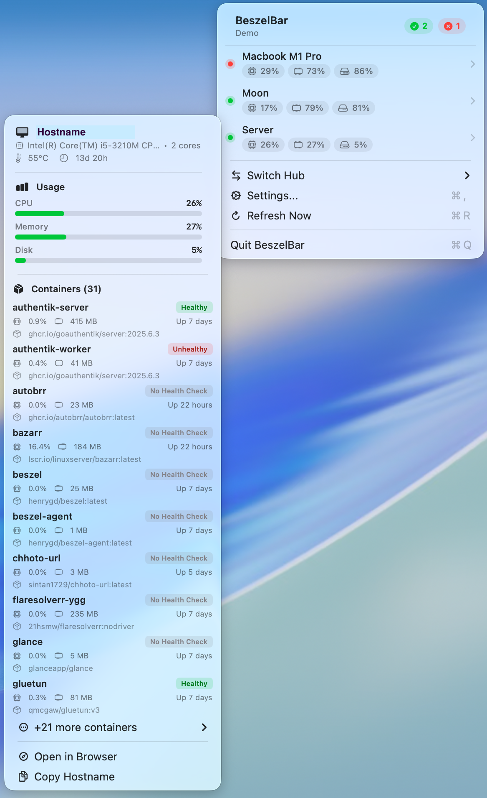

# BeszelBar.VO

A [BeszelBar](https://github.com/Loriage/BeszelBar) fork that keeps working when
your hub does not.



## Why

A monitoring hub is a single point of failure for the one job you cannot afford
to lose. Everything is fine until the machine hosting the hub goes down — and
then you lose the dashboard, the alerts, and any view of every *other* machine,
all at once, at exactly the moment you want to look.

Moving the hub somewhere else does not fix this. It moves the blind spot.
Whatever machine hosts the hub, that machine's death is the one death the hub
cannot report.

**BeszelBar.VO adds a second path with a different failure mode.** The hub stays
primary and keeps doing what it is good at. When it stops answering, the app
reads each machine **directly over SSH**, with no hub anywhere in the path.

- Hub answers → identical to upstream. SSH is never contacted.
- Hub fails → SSH targets are polled, live figures appear, and the menu says
  **⚠︎ Hub unreachable — SSH** with the underlying error.
- Hub recovers → back to normal on the next refresh, no intervention.
- No hub at all → SSH works on its own, if that is all you want.

A machine that is genuinely down shows as **down** rather than vanishing from the
list. A missing row reads as "nothing wrong here", which is the opposite of true.

## What this path does not give you

**No history and no alerts.** Those live in the hub's database, and no amount of
SSH will conjure them. This is a fallback for *sight*, not a replacement for
monitoring. If you need to be *told* when something dies while you are asleep,
you need a heartbeat service outside your fleet — nothing here does that.

## Requirements

Every machine you want to reach over SSH needs a Beszel agent that supports a
`stats` subcommand. Stock agents do not have it, so this repository ships the
patch that adds it — 35 lines, in [`agent-patch/`](agent-patch/).

You also need the Swift toolchain from Xcode Command Line Tools
(`xcode-select --install`). A full Xcode install is **not** required.

## Install

**1. Build and deploy the patched agent** to each machine:

```bash
cd agent-patch && ./build.sh
scp ../bin/beszel-agent-linux-amd64 you@host:/opt/beszel-agent/beszel-agent-stats
```

Install it *alongside* the agent already running, not over it. No service restart
is needed and rolling back is deleting one file.

**2. Create a key that can do nothing else.** On each target, add to
`authorized_keys` (`C:\ProgramData\ssh\administrators_authorized_keys` on
Windows):

```
command="/opt/beszel-agent/beszel-agent-stats stats",restrict ssh-ed25519 AAAA... stats-only
```

`restrict` disables port forwarding, agent forwarding, pty and X11. `command=`
runs that command and nothing else, whatever the client asks for. Confirm it took
by asking for something different and watching stats come back anyway:

```bash
ssh -i ~/.ssh/your_key you@host 'whoami'    # prints JSON, not a username
```

**3. Build and install the app:**

```bash
./build-spm.sh
cp -R build/Release/BeszelBar.app /Applications/
open /Applications/BeszelBar.app
```

**4. Add your machines** under Settings → SSH. Each target has a *Test
Connection* button — SSH configuration is fiddly enough that guessing is not good
enough.

> The bundle is ad-hoc signed, not notarized, so macOS will ask on first launch.
> Right-click → Open, or build it yourself and read the source first — which is
> rather the point of it being here.

## Also included

**[`cli/`](cli/)** — a terminal client that polls every machine in parallel and
prints a compact view. Same data path, no GUI, useful over SSH or in a script.

```
  ● my-server  host.example.net
      cpu   ████████··  82.2%   load 7.48 6.37 5.53 / 4c
      ram   ██████····  57.1%   3.30 / 5.79 GB   swap 0.66 / 1.88 GB
      disk  ████······  39.8%   21.7 / 57.1 GB
```

## How it works

The agent patch adds a mode that assumes no hub at all: run, sample, print JSON,
exit. No daemon, no listening port, nothing resident between polls.

**It calls upstream's own collector rather than reading `/proc`.** Reading
`/proc` would have been less work. But two independent implementations of
"percent memory used" will eventually disagree by half a point, and then somebody
has to work out which one is lying. Calling the same code makes that impossible:
the numbers match the dashboard because they *are* the dashboard's numbers.

What still differs is the sampling window, not the method — a 60-second average
looks calmer than a one-second sample of the same machine.

**The one-shot mode needed care.** `agent/cpu.go` records CPU counters in
`init()`, and every reading is a delta against a previous sample. A process that
starts and gathers immediately measures a delta over a few milliseconds:
arithmetically valid, completely meaningless. So it waits a sampling window
first. Memory and disk are point-in-time reads and need no wait.

**The mapping was nearly free.** Upstream's `SystemInfo` uses the same short keys
the agent emits, because the hub stores the agent's payload more or less
verbatim. Agent JSON decodes straight into the existing model and the menu
renders SSH-sourced data with no view changes at all.

See [`FORK.md`](FORK.md) for the full diff against upstream and
[`agent-patch/README.md`](agent-patch/README.md) for the patch.

## Known limits

- **Containers lose detail over SSH.** Health, status and image are `json:"-"`
  upstream — they only reach the hub over CBOR. Health shows as unknown rather
  than being invented.
- **No temperature sensors on Windows** unless you build with the .NET SDK; the
  build script writes a placeholder for the embedded component instead.
- **Version drift.** The stats binary and the running agent are separate files.
  Update one, rebuild the other, or they measure with different code.
- **Pull model.** It answers when you look. Your Mac has to be awake.

## Credit

This is a small amount of work sitting on two projects that did the hard parts:

- **[Loriage/BeszelBar](https://github.com/Loriage/BeszelBar)** — the menu bar app
  this forks. Upstream's README is preserved as
  [`UPSTREAM_README.md`](UPSTREAM_README.md); forked at
  [`8a0e3c7`](https://github.com/Loriage/BeszelBar/commit/8a0e3c7123853f5c312aebd8dfaf083d584484a2).
- **[henrygd/beszel](https://github.com/henrygd/beszel)** — the monitoring system
  itself. Not vendored here; `agent-patch/` is a patch, and upstream source is
  fetched at build time.

> BeszelBar's README declares MIT but the repository had no `LICENSE` file at the
> time of forking. That declaration is taken at face value. If you are the author
> and would prefer this handled differently, please open an issue.

## License

MIT — see [LICENSE](LICENSE), which carries both upstream copyright notices.
